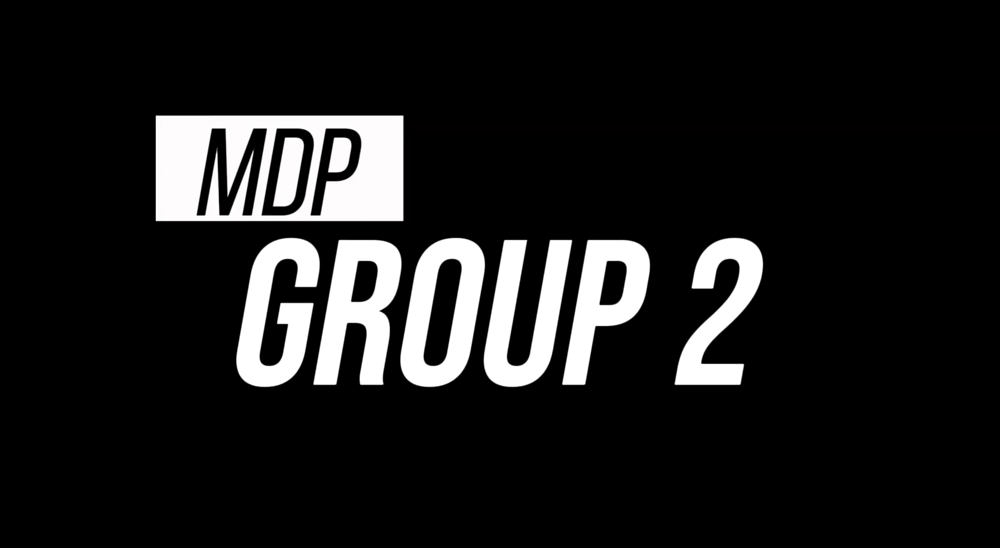

# SC2079-MDP-Group2-2026

Project Repo for SC2079 Multi-Disciplinary Project 2026

### YouTube Link
[](https://www.youtube.com/watch?v=WUxeIZfVJFk)

## Project Overview

This project is a **mini car robot navigation challenge**. The robot must navigate to multiple obstacles and complete image recognition tasks by identifying numbers displayed on each obstacle.

## System Architecture

```
┌─────────────────┐   Bluetooth (RFCOMM)   ┌─────────────────┐
│  Android Tablet │◄──────────────────────►│                 │
│  (User Input)   │                        │  Raspberry Pi   │
└─────────────────┘                        │  (Comm Hub +    │
                                           │   Camera)       │
┌─────────────────┐          USB Serial    │                 │
│   STM32 Board   │◄──────────────────────►│                 │
│ (Motor Control) │                        │                 │
└─────────────────┘                        └────────┬────────┘
                                                    │
                                           WiFi ────┤
                                                    │
                                          ┌─────────┴─────────┐
                                          │        PC         │
                                          │  Algo Service     │
                                          │  (:5001)          │
                                          │  YOLO Inference   │
                                          │  (ZMQ :5555/5556) │
                                          └───────────────────┘
```


## Components

| Component | Role |
|-----------|------|
| **Raspberry Pi** | Central communication hub. Bridges STM32, Android tablet, and PC. Hosts Pi Camera for vision. |
| **STM32 Board** | Controls car motors and movement based on commands from Pi. |
| **Android Tablet** | User interface for entering obstacle coordinates and navigation info. Connects to Pi via Bluetooth. |
| **PC (Laptop)** | Runs pathfinding algo service (:5001) and YOLO model inference for image recognition. |
| **Pi Camera** | Captures video stream sent to PC for real-time object detection. |

## Task 1 Flow

1. User enters obstacle positions on the Android tablet.
2. Android sends `ROBOT`, `OBSTACLE` messages, then `BEGIN` to RPi via Bluetooth.
3. RPi forwards obstacles to the **algo service** on PC (HTTP POST to `:5001/pathfinding`).
4. Algo service returns ordered path segments with movement instructions.
5. RPi translates instructions into STM32 commands, frames them, and batch-sends to STM32.
6. STM32 executes each 4-byte command sequentially, sending `DONE` after each.
7. RPi relays each completed instruction to Android as a UI update command.
8. On `CAPTURE_IMAGE` (`5000`), STM32 sends `HALT`; RPi runs image recognition via the YOLO detection stream, then sends `RESM` to resume.
9. Identified images are reported to Android as `TARGET,<obstacle>,<target_id>`.

## Task 2 Flow

Task 2 is a two-obstacle arrow decision challenge. The robot moves forward to an obstacle, uses the YOLO model to detect whether a LEFT or RIGHT arrow is displayed, turns accordingly, then repeats for a second obstacle.

1. User sends `BEGIN` from the Android tablet.
2. RPi sends `1000` (forward) to STM32 as a raw 4-char command (no `<>` framing or checksum).
3. On `DONE`, RPi runs a detection window (default 1s) counting LEFT vs RIGHT arrows from YOLO detections.
4. Based on majority vote, RPi sends `3000` (turn left) or `4000` (turn right) to STM32.
5. On `DONE`, RPi runs another detection window for the second obstacle.
6. RPi sends `3030` (second left) or `4040` (second right) to STM32.
7. On `DONE`, RPi sends `TASK2,DONE` to Android.

**Arrow mapping**: class ID 39 / "Left" → LEFT, class ID 38 / "Right" → RIGHT. Detection retries up to 4 times on ties.

## Android ↔ Raspberry Pi Protocol

**Transport**: Bluetooth RFCOMM (`/dev/rfcomm0`)

### Android → RPi

| Message | Format | Example |
|---------|--------|---------|
| Robot start position | `ROBOT,<x>,<y>,<direction>` | `ROBOT,0,0,NORTH` |
| Obstacle registration | `OBSTACLE,<id>,<x>,<y>,<direction>` | `OBSTACLE,1,120,120,NORTH` |
| Begin navigation | `BEGIN` | `BEGIN` |

Obstacle coordinates are in raw units (÷10 for grid position, e.g. 120 → grid 12).

### RPi → Android

| Message | Format | Example |
|---------|--------|---------|
| Forward/backward | `MOVE,<amount>,<FORWARD\|BACKWARD>` | `MOVE,50,FORWARD` |
| Arc turn | `TURN,<FORWARD_LEFT\|FORWARD_RIGHT\|BACKWARD_LEFT\|BACKWARD_RIGHT>` | `TURN,FORWARD_LEFT` |
| Stationary turn | `STAT_TURN,<LEFT\|RIGHT>` | `STAT_TURN,LEFT` |
| Image identified | `TARGET,<obstacle_id>,<target_id>` | `TARGET,3,12` |

## Raspberry Pi ↔ STM32 Protocol

**Transport**: USB Serial at 115200 baud (`/dev/ttyACM0`)

### Batch Command Frame

Instructions are concatenated and framed as: `<cmd1cmd2...cmdN>checksum`

Checksum = `(sum of all digit characters) % 100`

Example: `<603020206033>25`

### STM32 Command Codes (4 chars each)

| Code | Meaning |
|------|---------|
| `0000` | Stop |
| `1XXX` | Forward XXX cm (e.g. `1030` = 30 cm) |
| `2XXX` | Backward XXX cm |
| `3000` | Stationary turn left |
| `4000` | Stationary turn right |
| `5000` | Capture image (STM pauses, sends `HALT`, waits for `RESM`) |
| `6000` | Forward left |
| `7000` | Forward right |
| `8000` | Backward left |
| `9000` | Backward right |

### STM32 → RPi Responses

| Response | Meaning |
|----------|---------|
| `DONE` | Instruction completed, proceed to next |
| `HALT` | Paused at `5000`, waiting for RPi to finish image capture and send `RESM` |

## Image Recognition

- Video is streamed from Pi Camera to PC over ZMQ (port 5555)
- On PC, `imageReg/src/pc_receiver.py` subscribes to the stream, runs the fine-tuned YOLO model, and publishes detection results back to RPi over ZMQ (port 5556)
- RPi uses a rolling detection window (majority vote) to confirm identifications

## Directory Structure

| Directory | Description |
|-----------|-------------|
| `rpi/` | Raspberry Pi modules – see [rpi/README.md](rpi/README.md) |
| `android/` | Android tablet app (user input, Bluetooth communication with RPi) |
| `stm32/` | STM32 USB serial interface and test scripts |
| `service/` | Algo pathfinding REST API service (Flask, port 5001) |
| `imageReg/` | YOLO image recognition and PC-side receiver (`pc_receiver.py`) |
| `robot-path-visualizer/` | Robot path visualisation tool |

## Quick Start

### 1. On PC – Connect to Raspberry Pi WiFi

Connect your PC to the Raspberry Pi's WiFi hotspot. The Pi's default IP is `192.168.2.2`.

### 2. On PC – Start algo service (Task 1 only)

```bash
cd service
uv sync            # first time only
uv run python app.py    # starts Flask server on :5001
```

### 3. On PC – Start image recognition receiver

```bash
cd imageReg/src
uv sync            # first time only
uv run python pc_receiver.py --host 192.168.2.2 --port 5555
```

This subscribes to the Pi's camera stream over ZMQ, runs the fine-tuned YOLO model for inference, and publishes detection results back to the Pi on port 5556.

### 4. On Raspberry Pi

If RFCOMM is not already configured at startup (lab manual setup handles this automatically), bind it manually first:

```bash
sudo rfcomm listen /dev/rfcomm0 1 &
```

Then run a task:

```bash
cd rpi

# Task 1 – Obstacle navigation & image recognition
python task1.py --pc-host <PC_IP>

# Task 2 – Arrow-based obstacle decisions
python task2.py --pc-host <PC_IP>
```

See individual component READMEs for detailed setup instructions.
